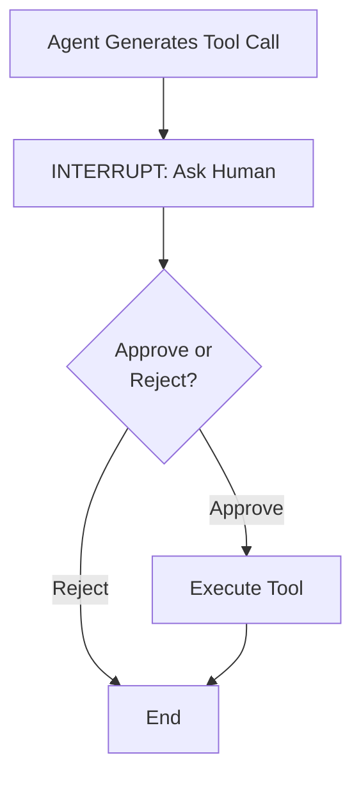
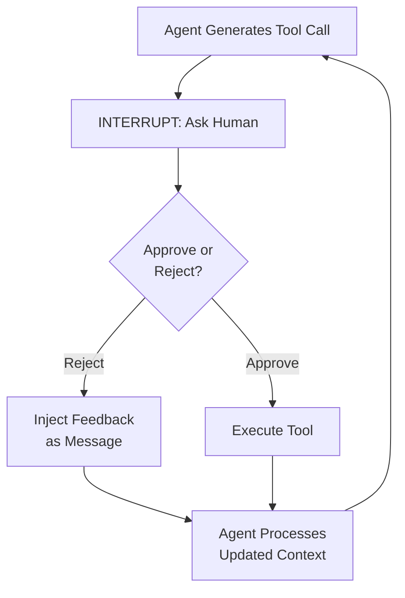

# Beyond One-Shot Approval: Building Iterative Human-in-the-Loop AI Agents

*How to build AI agents that don't force you into binary yes/no decisions when the stakes are high*

Your AI agent generates a tool call with the wrong parameters. You reject it. The conversation ends. Now you're back to square one, retyping your request and hoping it gets it right this time.

There has to be a better way.

## Introduction: The Limitation of Single-Interrupt HITL

Most Human-in-the-Loop (HITL) systems follow a simple pattern: an agent generates a tool call, pauses for human approval, and then either proceeds or stops. This works fine for straightforward approval scenarios, but it has a fundamental limitation.

What happens when the human wants to say "try with different parameters"?

In a typical single interrupt system, rejection ends the conversation. The user has to start over from scratch, restating their intent and hoping the agent makes a better choice next time.

Consider a common scenario: you're building an AI agent that searches the web for information. The agent decides to call a search tool with `backend="serp"`, but you don't have a SERP API key configured. In a single interrupt system, you reject the tool call, and the conversation ends.

There's no mechanism for the agent to adjust.

The problem becomes critical with consequential operations. An agent that deletes database records, modifies production files, or makes API calls with billing implications needs more than binary approve/reject. You need the ability to refine parameters, add constraints, or redirect the agent's approach without losing conversation context.

With a multi-turn edit loop, you can reject that tool call and provide feedback like "Use DuckDuckGo instead" or "Delete only records matching status=inactive". The agent regenerates its decision with that constraint in mind.

If there's still an issue, you reject again. And again. The loop persists until you get it right, or you decide to stop.

For dangerous operations, this iterative refinement is essential.

**What You'll Learn:**
- Why single interrupt HITL systems fail with destructive operations
- How to implement multi-turn approval loops in LangGraph
- Managing state and conversation history across rejection cycles
- Real code examples

This article shows how to build that pattern in LangGraph. We'll ground everything in a real, working implementation: a web search agent that requires human approval before any tool execution and allows unlimited rejection and retry cycles.

---

## Background: Understanding Interrupt Patterns

### The Single-Interrupt Pattern

Most HITL tutorials follow this flow:



The pattern is simple: pause the graph at a decision point, collect human input, then proceed or terminate.

This works for scenarios like do you authorize to delete this post? or do you authorize this $50 API call?.

But notice what happens if the human rejects: the conversation typically ends. If they want to retry with different parameters, they start over.

There's no mechanism for the agent to learn from the rejection and self-correct.

### The Multi-Turn Edit Loop Pattern

Multi-turn edit implementation introduces a crucial change:



**Key difference:** rejection loops back to the agent, not to the user.

The agent sees the rejection as a new human message in the conversation context and generates a revised tool call or abort tool calling completle. The point is that the next move is up to the agent based on the feedback. In case of a new tool call the human approves or rejects again, creating an iterative refinement loop.

This approach has several benefits:
- **Preserves conversation context** - nothing is lost between attempts
- **Allows the LLM to self-correct** - the agent learns from feedback
- **Creates a natural UX** - users guide the agent through multiple attempts to reach the desired outcome

---

## Architecture Overview

Let's examine the actual implementation. The graph structure in `src/agent.py` defines **four nodes**:

1. **agent** - Calls the LLM with tools
2. **approval** - Interrupts to request human decision
3. **tools** - Executes approved tool calls
4. **rejected** - Handles rejections by injecting feedback

The critical edges for multi-turn looping are:
- `agent` → `approval` (conditional: if tool calls exist)
- `approval` → `tools` (if approved)
- `approval` → `rejected` (if rejected)
- `tools` → `agent` (loop back)
- `rejected` → `agent` (loop back with feedback)

Notice the two edges feeding back into `agent`: after tool execution OR after rejection.

This creates the multi-turn loop.

The state schema (from `src/schemas.py`) is minimal but sufficient:

```python
class AgentState(TypedDict):
    messages: Annotated[Sequence[BaseMessage], add_messages]
    approved: bool
    feedback: str
```

Three fields with clear responsibilities:
- **messages** - Track the conversation history (system, user, assistant, and tool messages)
- **approved** - Boolean flag for the approval status
- **feedback** - Optional user guidance for rejections

We don't need complex history tracking because the graph structure and message accumulation handle everything.

---

## Implementation Deep-Dive

### The Agent Node

This node ensures the system message is always present and handles edge cases where the model needs prompting.

The agent node calls the language model with bound tools:

```python
def agent_node(state: AgentState, model):
    messages = state["messages"]
    
    if not messages or not isinstance(messages[0], SystemMessage):
        messages = [SystemMessage(content=get_system_prompt())] + messages
    
    response = model.invoke(messages)
    
    return {"messages": [response], "approved": False}
```

Let's break down what's happening:

First, we ensure a system message is always present at the beginning. This keeps the agent's behavior consistent across invocations.

Then we call the model with the current conversation messages.

The key point: all responses get appended to the state via the `add_messages` handler. The conversation history accumulates naturally with each node invocation.

### The Approval Node: Interrupting for Human Decision

The `interrupt()` call pauses execution and waits for human input, this is the gateway that enables multi-turn loops.

The approval node is where the multi-turn loops pause mechanism lives:

```python
def human_approval_node(state: AgentState):
    messages = state["messages"]
    last_message = messages[-1]
    
    if hasattr(last_message, 'tool_calls') and last_message.tool_calls:
        tool_calls_info = []
        for tool_call in last_message.tool_calls:
            tool_calls_info.append({
                "name": tool_call.get("name"),
                "args": tool_call.get("args", {})
            })
        
        approval_data = interrupt({
            "tool_calls": tool_calls_info,
            "message": "Tool call(s) require approval"
        })
        
        approved = approval_data.get("approved", False)
        feedback = approval_data.get("feedback", "The user rejected the tool call. Please revise your approach.")
        
        return {"approved": approved, "feedback": feedback}
    
    return {"approved": False, "feedback": ""}
```

The `interrupt()` call from LangGraph pauses execution and sends data to the client (whether that is a CLI, web UI, or API).

The client displays the tool calls and waits for human input. Once the human responds with approval status and optional feedback, that data gets captured and stored in state.

The gateway: if approved, execution proceeds to the tools node. If rejected, execution goes to the rejection handler.

### The Rejection Handler: Closing the Loop

This 3-line function is the secret sauce that transforms a one-shot system into an iterative refinement loop.

This is where the refinement mechanism lives:

```python
def handle_rejection(state: AgentState):
    feedback = state.get("feedback", "The user rejected the tool call. Please revise your approach.")
    feedback_message = HumanMessage(content=feedback)
    
    return {"messages": [feedback_message], "approved": False}
```

It's straightforward: take the user feedback and inject it back into the conversation as a `HumanMessage`.

Now the agent sees its own tool call (in the previous `AIMessage`) plus the human feedback (in this new `HumanMessage`).

On the next invocation, the agent regenerates with this full context. If the feedback was "Use DuckDuckGo instead of SERP," the agent will try that.

If it still doesn't work, the human rejects again, feedback accumulates, and the loop continues.

**Why this works:** We are not adding retry logic or error handling. We are simply injecting the human feedback as a message. To the agent, it looks like a natural continuation of the conversation.

---

## A Concrete Multi-Turn Example

Let's trace a realistic scenario:

### Round 1: Initial Request

**User:** "What is the latest news on AI safety?"

**Agent Thinks:** I need to search the web. I'll use the SERP backend

**Agent Tool Call:**
```json
{
  "name": "search_web",
  "args": {
    "queries": ["AI safety latest news 2025"],
    "backend": "serp",
    "num_results": 5
  }
}
```

**Human Rejects:** SERP requires an API key I don't have one.

**Human Rejects:** `approved=false, feedback="SERP requires an API key I don't have one."`

### Round 2: Agent Corrects

The rejection feedback is injected as a HumanMessage. The agent sees its previous attempt plus the correction request.

**Agent Thinks:** Oh, I tried SERP but the user doesn't have an API key. I will try DuckDuckGo backend.

**Agent Tool Call:**
```json
{
  "name": "search_web",
  "args": {
    "queries": ["AI safety latest news 2025"],
    "backend": "duckduckgo",
    "num_results": 5
  }
}
```

**Human Reviews:** Good! This looks right.

**Human Approves:** `approved=true`

### Round 3: Execution

The approved tool call executes, results come back as a ToolMessage, and the agent generates a summary from the results.

**Agent Output:** "Based on the latest search results, here are the key AI safety developments..."

**Conversation Ends:** User is satisfied, agent stops.

If the human rejected the DuckDuckGo search too, the loop would continue indefinitely. In practice, users either provide better feedback or manually stop.

---

## State Management and Persistence

An important aspect of this pattern is how state persists across interrupts. The key is LangGraph's checkpoint system. In `src/agent.py`:

```python
memory = MemorySaver()
compiled_graph = workflow.compile(checkpointer=memory)
```

When you invoke the compiled graph with a thread ID:

```python
config = {"configurable": {"thread_id": "session_123"}}
result = agent.invoke(initial_state, config=config)
```

What happens under the hood?

**First invocation:** The graph executes until it hits the `interrupt()` call in the approval node. At that point, LangGraph saves a checkpoint of the current state (including all messages, the pending tool call, and graph position) and returns control to the caller with interrupt data.

**Resume invocation:** When you call `invoke()` again with `Command(resume=approval_response)` using the same thread ID, LangGraph loads the checkpoint, injects the approval data, and continues execution from the approval node. Only this time it skeps the interrupt line.

The approval node completes, returning the approval status and feedback. Then the graph continues to either the tools node (if approved) or the rejected node (if rejected), both of which loop back to the agent node.

This checkpoint mechanism provides several guarantees:
- **Conversation history is preserved** across approval and rejection cycles
- **Tool calls are never executed twice** because execution only proceeds after human decision
- **Multiple sessions can run in parallel** each with its own thread ID

---

## UI Implementations: How Humans Interact

The multi-turn loop works the same regardless of UI, but the experience differs:

### CLI Implementation

The `process_interrupts()` function in `cli_demo.py` handles multiple approval cycles:

```python
def process_interrupts(agent, result, config):
    while "__interrupt__" in result:
        interrupt_data = result["__interrupt__"]
        
        if is_tool_approval_request(interrupt_data):
            approval_response = handle_tool_approval(interrupt_data)
            result.pop("__interrupt__")
            result = agent.invoke(
                Command(resume=approval_response),
                config=config
            )
        else:
            print(f"Unknown interrupt type: {interrupt_data}")
            break
    
    return result
```

The loop is explicit: while there's an interrupt, ask the human, get their response, and invoke the agent again with the approval data.

This handles multiple approval cycles in a single user turn.

### Streamlit Implementation

The Streamlit UI in `streamlit_demo.py` handles approvals differently because it is stateful:

```python
def handle_approval(approved: bool, feedback: str = ""):
    if not st.session_state.agent_result or not st.session_state.agent_config:
        return
    
    if approved:
        approval_response = {"approved": True}
    else:
        if not feedback:
            feedback = "The user rejected the tool call. Please revise your approach."
        approval_response = {"approved": False, "feedback": feedback}
    
    result = st.session_state.agent_result
    result.pop("__interrupt__")
    
    try:
        result = st.session_state.agent.invoke(
            Command(resume=approval_response),
            config=st.session_state.agent_config
        )
        
        response = process_agent_response(result)
        
        if response:
            st.session_state.messages.append({"role": "assistant", "content": response})
    
    except Exception as e:
        st.error(f"Error: {str(e)}")
```

When the user clicks "Approve" or "Reject" with feedback, this function resumes the graph with the approval data.

If the agent generates another tool call, the UI interrupts again and displays another approval prompt. The loop happens within Streamlit's page renders and reruns.

Both implementations achieve the same multi-turn loop, just adapted to their execution model.

---

## Generalizing Beyond Search

This pattern isn't specific to web search. It generalizes across any workflow requiring iterative human refinement of tool parameters.

### Web Research with Plan and Build

Consider an AI assistant helping you build a LangGraph agent. It searches documentation, plans the implementation, and generates code. With multi-turn approval:

The agent searches for "LangGraph interrupt patterns", but the results show outdated examples using deprecated APIs. You reject with feedback: "Search for 'LangGraph interrupt Command API 2025' instead to get current documentation."

The agent regenerates the search with updated parameters. Better results come back showing the modern `Command` API. You approve.

Now the agent plans the implementation based on those results. It proposes using `gemini-2.0-flash-thinking-exp` for the language model. You reject: "Use the latest flash model instead."

The agent adjusts the plan with the correct model choice. You review and approve, then code generation proceeds.

This is the same multi-turn loop we built for search, applied to a multi-step workflow. Each tool call search, plan review, implementation approval can be refined iteratively.


### API Orchestration and Planning

An agent plans a sequence of API calls: fetch user data, update records, send notifications.

You review the plan and realize it's missing error handling for the update step. You provide feedback: "Add rollback logic if the update fails."

The agent replans with that constraint, you review again, and approve when it's safe.

### The Power of the Pattern

The architecture stays identical across these domains. You change the tools and the domain logic, but the graph structure remains the same: interrupt, feedback injection, loop back to agent.

---

## Conclusion: Iterative Refinement as a First-Class Pattern

Single-interrupt HITL systems treat human involvement as a gating mechanism: pause, ask, proceed or abort.

But real workflows are iterative. Users need to steer, adjust, and refine. With destructive operations like database deletions or API calls with side effects, iteration isn't just nice to have, it's non negotiable.

The multi-turn edit loop pattern, enabled by a simple architectural change (rejection looping to agent), transforms HITL systems from binary gates into interactive refinement engines.

Users don't just approve or reject. They guide the agent through multiple attempts toward the desired outcome.

### What It Takes to Build This

Building this pattern required:
- **Clear graph structure** with explicit feedback edges
- **State management** to track conversation history
- **Feedback injection** as conversation messages
- **Checkpoint persistence** across approval cycles

The implementation in this codebase demonstrates that you don't need elaborate systems. A simple 4-node graph, a basic state schema, and proper message handling unlock powerful multi-turn interaction.

### Why This Matters

If you're building tool-based agents or agents that connects to MCPs, consider this pattern. It's a small architectural change with outsized UX benefits.

Whether you're generating code, extracting data, orchestrating APIs, or searching the web, iteration is essential.

---

## What's Next?

**Try it yourself:** The complete code for this implementation is available in the repository. Clone it, create a .env file with your keys, run the CLI or Streamlit demos, and see multi-turn approval in action.

**Share your experience:** What tool calls are you protecting against in your agents? Share your approach in the comments, I would love to hear what's working (or not working) for you.

If you found this helpful, follow me for more deep-dives into LangGraph patterns and agentic system architecture.

---

## References and Further Exploration

- **LangGraph Documentation**: https://langchain-ai.github.io/langgraph/
- **Interrupt and Command API**: Key to implementing resumable flows
- **Checkpointing**: Essential for multi-turn conversation persistence
- **Tool Binding**: How LangChain agents bind tools to language models

The code for this implementation is available in this repository: https://github.com/roihezkiyahu/HITL-demo. Explore `src/agent.py` for the graph definition, `src/nodes.py` for node implementations, and both `cli_demo.py` and `streamlit_demo.py` for UI specific patterns.

Happy building.
