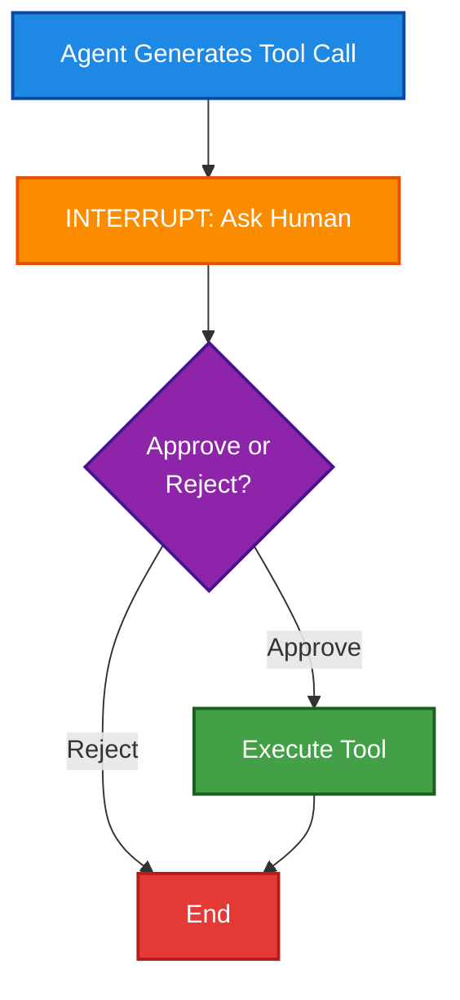
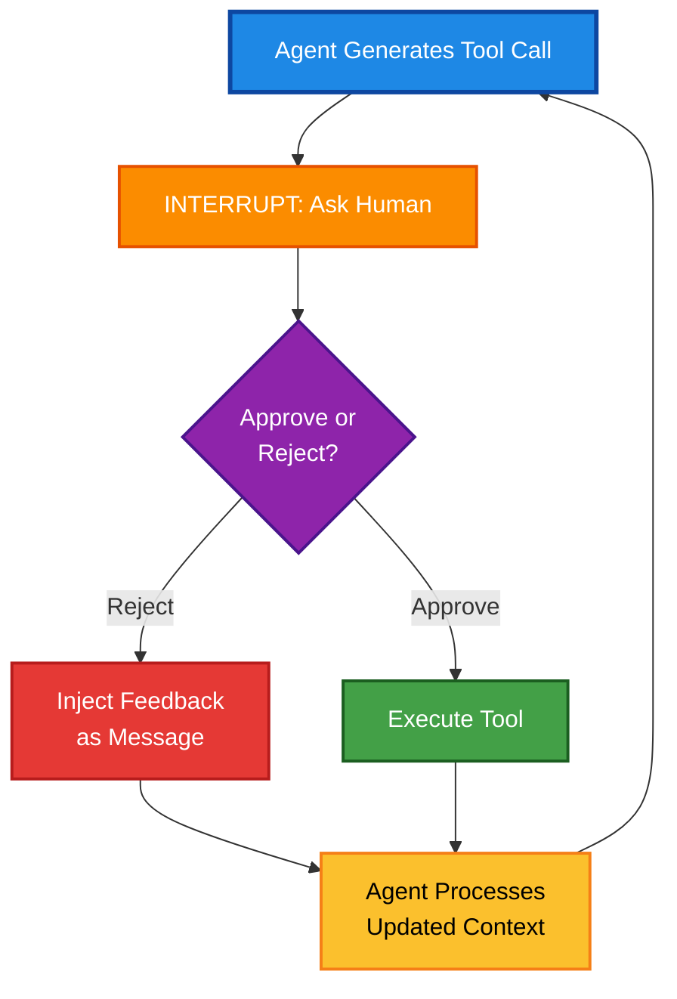

# Beyond One-Shot Approval: Building Iterative Human-in-the-Loop AI Agents

*How to build AI agents that don't force you into binary yes/no decisions when the stakes are high*

## Introduction: The Problem with Single Interrupts

Your AI agent is about to delete 10,000 database records. You have 3 seconds to decide: approve or reject.

Wait-you meant the *staging* database, not production. But it's too late. The tool is already running.

Most Human-in-the-Loop (HITL) tutorials stop at the same place: an agent pauses, asks for human approval, and then either proceeds or fails. Single interrupt patterns work fine for one-shot decisions, but they break down in real workflows where you need to refine, iterate, and correct tool inputs across multiple turns.

Consider a common scenario: you're building an AI agent that searches the web for information. The agent decides to call a search tool with `backend="serp"`, but you don't have a SERP API key configured. What happens next?

Most single-interrupt HITL systems either fail or let the tool error out. The conversation ends.

But the stakes get higher with destructive tools. Imagine an agent that deletes database records, modifies files, or executes API calls with billing implications. A single-interrupt system forces a binary choice: approve and execute, or reject and start over.

There's no room for "wait, let me check that parameter first" or "I think you should delete from the staging table, not production." If rejection kills the conversation, you can't refine your intent. With destructive operations, that's not just inconvenient-it's dangerous.

With a multi-turn edit loop, you can reject that tool call and provide feedback like "Use DuckDuckGo instead" or "Delete only records matching status=inactive". The agent regenerates its decision with that constraint in mind.

If there's still an issue, you reject again. And again. The loop persists until you get it right, or you decide to stop.

For dangerous operations, this iterative refinement is essential.

**What You'll Learn:**
- Why single-interrupt HITL systems fail with destructive operations
- How to implement multi-turn approval loops in LangGraph
- Managing state and conversation history across rejection cycles
- Real code examples you can run today

**Reading time:** 12 minutes | **Skill level:** Intermediate

This article shows you how to build that pattern in LangGraph. We'll ground everything in a real, working implementation: a web search agent that requires human approval before any tool execution and allows unlimited rejection and retry cycles.

---

## Background: Understanding Interrupt Patterns

### The Single-Interrupt Pattern

Most HITL tutorials follow this flow:



The pattern is simple: pause the graph at a decision point, collect human input, then proceed or terminate.

This works for scenarios like content moderation (should this post be deleted?) or cost estimation (do you authorize this $50 API call?).

But notice what happens if the human rejects: the conversation typically ends. If they want to retry with different parameters, they start over.

There's no mechanism for the agent to learn from the rejection and self-correct.

### The Multi-Turn Edit Loop Pattern

Our implementation introduces a crucial change:



**Key difference:** rejection loops back to the agent, not to the user.

The agent sees the rejection as a new human message in the conversation context and generates a revised tool call. The human approves or rejects again, creating an iterative refinement loop.

This approach has several benefits:
- **Preserves conversation context** - nothing is lost between attempts
- **Allows the LLM to self-correct** - the agent learns from feedback
- **Creates a natural UX** - users guide the agent through multiple attempts to reach the desired outcome

---

## Architecture Overview

Let's examine the actual implementation. The graph structure in `src/agent.py` defines **four nodes**:

1. **agent** - Calls the LLM with tools
2. **approval** - Interrupts to request human decision
3. **tools** - Executes approved tool calls
4. **rejected** - Handles rejections by injecting feedback

The critical edges for multi-turn looping are:
- `agent` → `approval` (conditional: if tool calls exist)
- `approval` → `tools` (if approved)
- `approval` → `rejected` (if rejected)
- `tools` → `agent` (loop back)
- `rejected` → `agent` (loop back with feedback)

Notice the two edges feeding back into `agent`: after tool execution OR after rejection.

This creates the multi-turn loop.

The state schema (from `src/schemas.py`) is minimal but sufficient:

```python
class AgentState(TypedDict):
    messages: Annotated[Sequence[BaseMessage], add_messages]
    approved: bool
    feedback: str
```

Three fields with clear responsibilities:
- **messages** - Track the conversation history (system, user, assistant, and tool messages)
- **approved** - Boolean flag for the approval status
- **feedback** - Optional user guidance for rejections

This simplicity is key. We don't need complex iteration counters or history tracking because the graph structure and message accumulation handle everything.

---

## Implementation Deep-Dive

### The Agent Node

**Key Insight:** This node ensures the system message is always present and handles edge cases where the model needs prompting.

The agent node calls the language model with bound tools:

```python
def agent_node(state: AgentState, model):
    messages = state["messages"]
    
    if not messages or not isinstance(messages[0], SystemMessage):
        messages = [SystemMessage(content=get_system_prompt())] + messages
    
    response = model.invoke(messages)
    
    if not response.content and not getattr(response, 'tool_calls', None):
        has_tool_message = any(isinstance(msg, ToolMessage) for msg in messages)
        
        if has_tool_message:
            prompt_message = HumanMessage(content="Please provide a summary of the search results above.")
            retry_response = model.invoke(messages + [prompt_message])
            return {"messages": [response, prompt_message, retry_response], "approved": False}
    
    return {"messages": [response], "approved": False}
```

Let's break down what's happening:

First, we ensure a system message is always present at the beginning. This keeps the agent's behavior consistent across invocations.

Then we call the model with the current conversation messages.

The code handles an edge case where the model returns tool results but no content. This can happen when search results come back but the model hasn't summarized them yet. In that scenario, we prompt the model to provide a summary.

The key point: all responses get appended to the state via the `add_messages` handler. The conversation history accumulates naturally with each node invocation.

### The Approval Node: Interrupting for Human Decision

**Key Insight:** The `interrupt()` call pauses execution and waits for human input-this is the gateway that enables multi-turn loops.

The approval node is where the multi-turn loop's pause mechanism lives:

```python
def human_approval_node(state: AgentState):
    messages = state["messages"]
    last_message = messages[-1]
    
    if hasattr(last_message, 'tool_calls') and last_message.tool_calls:
        tool_calls_info = []
        for tool_call in last_message.tool_calls:
            tool_calls_info.append({
                "name": tool_call.get("name"),
                "args": tool_call.get("args", {}),
                "id": tool_call.get("id")
            })
        
        approval_data = interrupt({
            "tool_calls": tool_calls_info,
            "message": "Tool call(s) require approval"
        })
        
        approved = approval_data.get("approved", False)
        feedback = approval_data.get("feedback", "The user rejected the tool call. Please revise your approach.")
        
        return {"approved": approved, "feedback": feedback}
    
    return {"approved": False, "feedback": ""}
```

The `interrupt()` call from LangGraph pauses execution and sends data to the client (whether that's a CLI, web UI, or API).

The client displays the tool calls and waits for human input. Once the human responds with approval status and optional feedback, that data gets captured and stored in state.

This is the gateway: if approved, execution proceeds to the tools node. If rejected, execution goes to the rejection handler.

### The Rejection Handler: Closing the Loop

**Key Insight:** This 3-line function is the secret sauce that transforms a one-shot system into an iterative refinement loop.

This is where the loop's refinement mechanism lives:

```python
def handle_rejection(state: AgentState):
    feedback = state.get("feedback", "The user rejected the tool call. Please revise your approach.")
    feedback_message = HumanMessage(content=feedback)
    
    return {"messages": [feedback_message], "approved": False}
```

It's straightforward: take the user's feedback and inject it back into the conversation as a `HumanMessage`.

Now the agent sees its own tool call (in the previous `AIMessage`) plus the human's feedback (in this new `HumanMessage`).

On the next invocation, the agent regenerates with this full context. If the feedback was "Use DuckDuckGo instead of SERP," the agent will try that.

If it still doesn't work, the human rejects again, feedback accumulates, and the loop continues.

**Why this works:** The agent doesn't need special retry logic. It just responds to what looks like a new human message in an ongoing conversation.

---

## A Concrete Multi-Turn Example

Let's trace a realistic scenario:

### Round 1: Initial Request

**User:** "What's the latest news on AI safety?"

**Agent Thinks:** I need to search the web. I'll use the SERP backend for quality results.

**Agent Tool Call:**
```json
{
  "name": "search_web",
  "args": {
    "queries": ["AI safety latest news 2025"],
    "backend": "serp",
    "num_results": 5
  }
}
```

**Human Reviews:** Hmm, SERP requires an API key I don't have configured.

**Human Rejects:** `approved=false, feedback="I don't have a SERP API key. Please use the free DuckDuckGo backend instead."`

### Round 2: Agent Corrects

The rejection feedback is injected as a HumanMessage. The agent sees its previous attempt plus the correction request.

**Agent Thinks:** Oh, I tried SERP but the user doesn't have that API key. They want DuckDuckGo. Let me try again.

**Agent Tool Call:**
```json
{
  "name": "search_web",
  "args": {
    "queries": ["AI safety latest news 2025"],
    "backend": "duckduckgo",
    "num_results": 5
  }
}
```

**Human Reviews:** Good! This looks right.

**Human Approves:** `approved=true`

### Round 3: Execution

The approved tool call executes, results come back as a ToolMessage, and the agent generates a summary from the results.

**Agent Output:** "Based on the latest search results, here are the key AI safety developments..."

**Conversation Ends:** User is satisfied, agent stops.

If the human rejected the DuckDuckGo search too, the loop would continue indefinitely. In practice, users either provide better feedback or manually stop.

**The key takeaway:** Notice how the agent naturally adapted to the constraint without needing special error handling or retry logic.

---

## State Management and Persistence

An important aspect of this pattern is how state persists across approvals. The answer is LangGraph's checkpoint system. In `src/agent.py`:

```python
memory = MemorySaver()
compiled_graph = workflow.compile(checkpointer=memory)
```

`MemorySaver` stores the graph state by thread ID. When you call:

```python
config = {"configurable": {"thread_id": "session_123"}}
result = agent.invoke(initial_state, config=config)
```

LangGraph saves the state with that thread ID. When you interrupt and then resume (after the human decision), LangGraph retrieves the checkpoint, resumes execution, and continues seamlessly.

This means:
- **Conversation history is preserved** across approval and rejection cycles
- **Tool calls are never executed twice** because you only resume after human decision
- **Multiple sessions can run in parallel** each with its own thread ID

For the CLI in `cli_demo.py`, a single thread ID is used per session. For Streamlit in `streamlit_demo.py`, each session gets a unique thread ID.

This allows the same agent to handle multiple concurrent users.

---

## UI Implementations: How Humans Interact

The multi-turn loop works the same regardless of UI, but the experience differs:

### CLI Implementation

The `process_interrupts()` function in `cli_demo.py` handles multiple approval cycles:

```python
def process_interrupts(agent, result, config):
    while "__interrupt__" in result:
        interrupt_data = result["__interrupt__"]
        
        if is_tool_approval_request(interrupt_data):
            approval_response = handle_tool_approval(interrupt_data)
            result.pop("__interrupt__")
            result = agent.invoke(
                Command(update=approval_response, resume=approval_response),
                config=config
            )
        else:
            print(f"Unknown interrupt type: {interrupt_data}")
            break
    
    return result
```

The loop is explicit: while there's an interrupt, ask the human, get their response, and invoke the agent again with the approval data.

This handles multiple approval cycles in a single user turn.

### Streamlit Implementation

The Streamlit UI in `streamlit_demo.py` handles approvals differently because it's stateful:

```python
def handle_approval(approved: bool, feedback: str = ""):
    if not st.session_state.agent_result or not st.session_state.agent_config:
        return
    
    if approved:
        approval_response = {"approved": True}
    else:
        if not feedback:
            feedback = "The user rejected the tool call. Please revise your approach."
        approval_response = {"approved": False, "feedback": feedback}
    
    result = st.session_state.agent_result
    result.pop("__interrupt__")
    
    try:
        result = st.session_state.agent.invoke(
            Command(update=approval_response, resume=approval_response),
            config=st.session_state.agent_config
        )
        
        response = process_agent_response(result)
        
        if response:
            st.session_state.messages.append({"role": "assistant", "content": response})
    
    except Exception as e:
        st.error(f"Error: {str(e)}")
```

When the user clicks "Approve" or "Reject" with feedback, this function resumes the graph with the approval data.

If the agent generates another tool call, the UI interrupts again and displays another approval prompt. The loop happens within Streamlit's page renders and reruns.

Both implementations achieve the same multi-turn loop, just adapted to their execution model:
- **CLI:** blocks synchronously
- **Streamlit:** rerenders asynchronously

---

## Extending the Pattern for Production Use

This simple implementation can be refined for more complex production scenarios.

### Adding Iteration Controls

**The problem:** The current implementation allows infinite rejection cycles.

**Solutions for production:**
- Add an explicit counter that increments on each rejection
- Use timeout logic to prevent runaway loops
- Add cost tracking to abort after too many tool invocations

For systems handling destructive operations, these safeguards are essential.

### Structured Feedback for Better Refinement

**The problem:** The multi-turn loop works best when feedback is specific and actionable. If a user rejects with just "This is wrong," the agent might struggle to improve.

**Solutions:**
- Provide structured feedback forms (checkboxes, dropdowns)
- Show examples of good feedback to guide users
- Have the agent propose corrections for the user to choose from

Clear, specific feedback dramatically improves the agent's ability to self-correct.

### Handling Stateful Operations

**The current approach:** We only execute tools after approval, so there's no risk of repeated invocations.

**If you need intermediate execution:** You'd need idempotency guarantees or rollback mechanisms to protect stateful operations. This is important for debugging or real-time feedback scenarios.

### Context Management for Long Conversations

**The problem:** Messages accumulate in state with each loop turn. For long approval cycles, this could exceed token limits.

**Solutions:**
- Summarize old messages periodically
- Archive messages to external storage
- Implement a sliding window of recent messages

The good news: when this becomes an issue, these are straightforward retrofits.

---

## Generalize Beyond Tool Approval

This pattern isn't specific to tool calls or even to search functionality. It generalizes across any workflow requiring iterative human refinement.

### Code Generation Workflows

Claude Code and Cursor both implement interactive code generation where users can reject initial suggestions, provide feedback on what to change, and watch the AI regenerate improved code.

The loop runs until the code meets the user's requirements.

### Content Creation and Editing

A system generates content, the human reviews it, provides editorial notes, and the system refines.

This applies to article writing, documentation, marketing copy, or any creative output.

### Data Extraction and Validation

Extract fields from unstructured data, show the results to a human, flag errors or inconsistencies, and have the agent re-extract with corrections.

This is more reliable than hoping for accuracy on the first pass.

### API Orchestration and Planning

An agent plans a sequence of API calls, the human reviews the plan and flags potential issues, the agent replans with constraints.

This repeats until the plan is safe and optimal.

### The Power of the Pattern

The architecture stays identical across these domains. You change the nodes to fit your domain (instead of search, you call a code generator. instead of rejection, you flag bad data), but the graph structure and loop mechanism remain the same.

This is the power of the pattern: it's simple enough to understand quickly but flexible enough to solve diverse problems.

---

## Conclusion: Iterative Refinement as a First-Class Pattern

Single-interrupt HITL systems treat human involvement as a gating mechanism: pause, ask, proceed or abort.

But real workflows are iterative. Users need to steer, adjust, and refine. With destructive operations like database deletions or API calls with side effects, iteration isn't just nice to have-it's non-negotiable.

The multi-turn edit loop pattern, enabled by a simple architectural change (rejection looping to agent), transforms HITL systems from binary gates into interactive refinement engines.

Users don't just approve or reject. They guide the agent through multiple attempts toward the desired outcome.

### What It Takes to Build This

Building this pattern required:
- **Clear graph structure** with explicit feedback edges
- **State management** to track conversation history
- **Feedback injection** as conversation messages
- **Checkpoint persistence** across approval cycles

The implementation in this codebase demonstrates that you don't need elaborate systems. A simple 4-node graph, a basic state schema, and proper message handling unlock powerful multi-turn interaction.

### Why This Matters

If you're building tool-based agents, consider this pattern early. It's a small architectural change with outsized UX benefits.

Whether you're generating code, extracting data, orchestrating APIs, or searching the web, iteration is essential.

Make it a first-class feature of your graph.

---

## What's Next?

**Try it yourself:** The complete code for this implementation is available in the repository. Clone it, run the CLI or Streamlit demos, and see multi-turn approval in action.

**Share your experience:** What dangerous tool calls are you protecting against in your agents? Have you implemented similar HITL patterns? Share your approach in the comments-I'd love to hear what's working (or not working) for you.

**Coming soon:** In the next post, we'll explore adding cost controls and iteration limits to this pattern, plus strategies for handling parallel tool calls that need coordinated approval.

If you found this helpful, follow me for more deep-dives into LangGraph patterns and agentic system architecture.

---

## References and Further Exploration

- **LangGraph Documentation**: https://langchain-ai.github.io/langgraph/
- **Interrupt and Command API**: Key to implementing resumable flows
- **Checkpointing**: Essential for multi-turn conversation persistence
- **Tool Binding**: How LangChain agents bind tools to language models

The code for this implementation is available in the repository. Explore `src/agent.py` for the graph definition, `src/nodes.py` for node implementations, and both `cli_demo.py` and `streamlit_demo.py` for UI-specific patterns.

Happy building.
